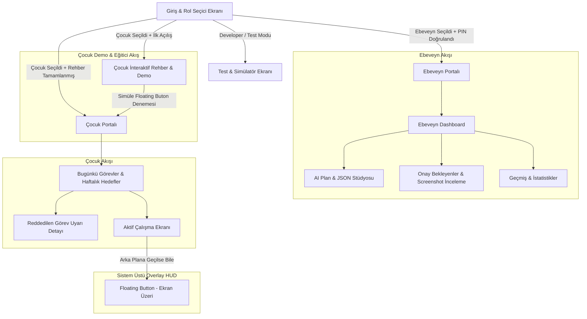

# StudyTracker - UI / UX Tasarım ve Ekran Mimarisi Planı

Bu doküman, **StudyTracker** Android uygulamasının tüm kullanıcı arayüzü (UI), kullanıcı deneyimi (UX), ekran yerleşimleri, bileşen hiyerarşisi, buton konumları ve etkileşim modellerini adım adım tanımlar.

---

## 1. Tasarım Sistemi ve Görsel Dil (Design Tokens)

- **Temel Felsefe:** Çocuklar için dikkat dağıtıcı unsurlardan arındırılmış, motivasyon artırıcı ve dokunma hedefleri büyük (min 48dp - 56dp) "Görev Odaklı HUD"; Ebeveynler için ise hızlı denetim, net kanıt çizelgesi ve esnek planlama sunan modern, kart tabanlı Material 3 arayüzü.
- **Renk Paleti (Theme Palette):**
  - **Primary (Canlı Safir):** `#2563EB` / `Dark: #60A5FA` (Ebeveyn ana aksiyonları, odak butonları)
  - **Child Accent (Enerjik Zümrüt / Başarı):** `#10B981` / `Dark: #34D399` (Çocuk başlat butonu, tamamlandı rozetleri)
  - **Warning / Rejected (Kehribar / Uyarı):** `#F59E0B` / `Dark: #FBBF24` (Reddedilen görevler, dikkat kartları)
  - **Active Session (Morötesi Işıltı):** `#8B5CF6` / `Dark: #A78BFA` (Aktif çalışan oturum ve Floating Button)
  - **Surface & Backgrounds:** Aydınlık modda `#F8FAFC`, `#FFFFFF`; Koyu modda `#0F172A`, `#1E293B`.
- **Tipografi:** Başlıklar: Bold / SemiBold (20sp - 24sp), Görev Kartları: Medium (16sp), Zaman & Süre Etiketleri: Monospace Tabular (14sp).

---

## 2. Navigasyon ve Ekran Hiyerarşisi (Vertical Flow)



---

## 3. Ekran Detayları ve Buton Yerleşimleri

### 3.1. Ekran 0: Rol Seçici ve Hızlı Geçiş (Root Role Switcher)

```text
┌──────────────────────────────────────────┐
│  StudyTracker                            │
│  Lütfen Profilinizi Seçin                │
├──────────────────────────────────────────┤
│                                          │
│  ┌────────────────────────────────────┐  │
│  │  👨‍👧 Ebeveyn Modu                    │  │
│  │  Planlama, onay ve inceleme        │  │
│  │  [ PIN ile Giriş Yap ]             │  │
│  └────────────────────────────────────┘  │
│                                          │
│  ┌────────────────────────────────────┐  │
│  │  🚀 Öğrenci / Çocuk Modu           │  │
│  │  Görevlerimi gör ve çalışmaya başla│  │
│  │  [ Doğrudan Başla ]                │  │
│  └────────────────────────────────────┘  │
│                                          │
│  ──────────────────────────────────────  │
│  [ 🛠️ Geliştirici & Test Modu (PIN: 0000) ]│
└──────────────────────────────────────────┘
```

- **Üst Bar:** Sade logo ve durum göstergesi.
- **Ana Kart 1 (Ebeveyn):** 4 haneli PIN BottomSheet açar.
- **Ana Kart 2 (Çocuk):** PIN gerektirmez, doğrudan bugünün görevlerine aktarır.
- **Alt Bar:** Kompakt Test Modu butonu (hızlı prototipleme için).

---

### 3.2. Ekran 1: Çocuk İnteraktif Demo & Rehber Modu (Child Tutorial & Onboarding)

İlk açılışta veya rehber butonuna basıldığında açılan, animasyonlu 3 adımlı interaktif mini simülatör.

```text
┌──────────────────────────────────────────┐
│  🚀 StudyTracker'a Hoş Geldin!           │
│  [ Adım 2 / 3: Yüzen Düğmeyi Öğren ]     │
├──────────────────────────────────────────┤
│                                          │
│         🌟 SENİN SÜPER GÜCÜN:            │
│         YÜZEN DERS DÜĞMESİ!              │
│                                          │
│  Ders çalışırken ekranda bu mor düğme   │
│  duracak. Hadi şimdi dene:               │
│                                          │
│             ┌──────────┐                 │
│             │ 🟣 00:05 │                 │
│             │ 📸 [0]   │   <-- [Dene!]   │
│             └──────────┘                 │
│                                          │
│  👉 1 Kez Dokun: Fotoğraf çek!           │
│  👉 2 Saniye Basılı Tut: Dersi bitir!   │
│                                          │
│  [ Tebrikler! Fotoğraf çektin! (Yeşil) ] │
│                                          │
│  ┌────────────────────────────────────┐  │
│  │ [ 🚀 Görev Masama Başla ]          │  │
│  └────────────────────────────────────┘  │
└──────────────────────────────────────────┘
```

- **Rehber Aşamaları:**
  1. *Adım 1 - Görev Masası:* Görevleri nasıl başlatacağı anlatılır.
  2. *Adım 2 - İnteraktif Düğme Simülasyonu:* Çocuk ekrandaki test düğmesine basarak fotoğraf çekmeyi ve 2 saniye basılı tutarak bitirmeyi bizzat deneyimler (haptik titreşim + konfeti efekti).
  3. *Adım 3 - Güven ve Onay:* Fotoğrafların ebeveynine gittiği ve onaylanınca yeşil olacağı gösterilir.

---

### 3.3. Ekran 2: Çocuk Portalı - Görev Masası (Child Home)

Çocuğun dikkatini dağıtmayacak, büyük ve renkli kartlar.

```text
┌──────────────────────────────────────────┐
│ 🚀 Selam, Ahmet!           [☀️ Hafta 25] │
│ Bugünkü İlerlemen: ████████░░ 4/5 Görev  │
├──────────────────────────────────────────┤
│ ⚠️ DİKKAT GEREKTİREN GÖREVLER (Varsa)    │
│ ┌──────────────────────────────────────┐ │
│ │ ⚠️ Deneme Çöz (Ebeveyn Notu: Eksik)   │ │
│ │ Süre: 120 dk | [ 🔄 Tekrar Başlat ]  │ │
│ └──────────────────────────────────────┘ │
│                                          │
│ 📅 BUGÜNKÜ GÖREVLER (16 Haziran)         │
│ ┌──────────────────────────────────────┐ │
│ │ 📺 Matematik Videosu İzle            │ │
│ │ ⏱️ 30 dk  • 🔗 YouTube Dersi          │ │
│ │ [ ▶️ ÇALIŞMAYI BAŞLAT (Yeşil Buton)] │ │
│ └──────────────────────────────────────┘ │
│ ┌──────────────────────────────────────┐ │
│ │ 📖 Paragraf Oku                      │ │
│ │ ⏱️ 20 dk • ⏳ Onay Bekliyor (Sarı)    │ │
│ └──────────────────────────────────────┘ │
│ ┌──────────────────────────────────────┐ │
│ │ 🧠 Anki Kelime Çalış                 │ │
│ │ ⏱️ 25 dk • ✅ Tamamlandı (Yeşil Rozet)│ │
│ └──────────────────────────────────────┘ │
│                                          │
│ 🎯 BU HAFTANIN HEDEFLERİ                 │
│ ┌──────────────────────────────────────┐ │
│ │ 🏆 Haftalık Uzun Video [ 1 / 2 Yapıldı││
│ └──────────────────────────────────────┘ │
└──────────────────────────────────────────┘
```

- **Üst Kısım (Header):** Karşılama metni, güncel hafta rozeti ve dairesel/çubuk ilerleme göstergesi.
- **Uyarı Alanı (Varsa):** Ebeveyn tarafından reddedilen görevler en üstte kırmızı/kehribar kartla listelenir. Yanında "Ebeveyn Notu" ve büyük "Tekrar Başlat" butonu yer alır.
- **Günlük Görev Kartları:**
  - **Başlatılabilir Görev:** Sağ altta geniş `[ ▶️ ÇALIŞMAYI BAŞLAT ]` butonu (Yükseklik: 52dp).
  - **Onay Bekleyen Görev:** `⏳ Ebeveyn Onayı Bekliyor` sarı durum rozeti (Tıklanamaz, kilitli).
  - **Tamamlanan Görev:** `✅ Tamamlandı` yeşil arka plan ve onay ikonu.
- **Haftalık Hedefler:** Hedef barı (`[1/2]`) ve kalan haklar.

---

### 3.3. Ekran 2: Floating HUD (Sistem Üstü Yüzen Buton & Bitirme Mekanizması)

Çocuk bir görevi başlattığında uygulama simge durumuna küçülse veya YouTube/Kitap/Anki uygulamasına geçilse dahi ekranda görünür.

```text
                  ┌──────────────────────┐
                  │ 📱 Başka Uygulama    │
                  │   (YouTube / Anki)   │
                  │                      │
                  │        ┌──────────┐  │
                  │        │ 🟣 24:15 │  │  <-- [Floating Pill / Düğme]
                  │        │ 📸 [5]   │  │      - Tek Dokunuş: Screenshot Al
                  │        └──────────┘  │      - 2sn Uzun Bas: Görevi Bitir
                  │                      │
                  └──────────────────────┘
```

- **Fiziksel Özellikler:**
  - Ekranın kenarlarına manyetik yapışma (Magnetic snap-to-edge).
  - Şeffaflık: Boştayken `%85`, dokunulduğunda `%100` opaklık.
  - Sayaç: Görevde geçen süreyi canlı gösterir (`24:15`).
  - Screenshot Rozeti: Alınan anlık görüntü adedi (`📸 5`).
- **Etkileşimler:**
  1. **Tek Dokunma (Single Tap):** "Ekran Görüntüsü Alındı" haptik titreşimi + ekranda 0.2 saniyelik beyaz flaş efekti + sayaç 1 artar.
  2. **Uzun Basma (Long Press 2 saniye):** Düğmenin etrafında dairesel yeşil halka dolar. 2 saniye dolduğunda haptik geri bildirim verilir, son screenshot otomatik kaydedilir, oturum kapatılır ve floating buton ekrandan kaybolur.

---

### 3.4. Ekran 3: Ebeveyn Portalı - Yönetim Paneli (Parent Dashboard)

```text
┌──────────────────────────────────────────┐
│ 👨‍👧 Ebeveyn Masası        [🔔 2 İnceleme] │
│ Aktif Plan: 2026-W25 (Ahmet)             │
├──────────────────────────────────────────┤
│ 🚨 İNCELEME BEKLEYEN ÇALIŞMALAR (2 Adet) │
│ ┌──────────────────────────────────────┐ │
│ │ 📺 Matematik Videosu                 │ │
│ │ ⏱️ 31 dk • 📸 4 Ekran Görüntüsü      │ │
│ │ [ 👁️ İncele ] [ ✅ Onayla ] [ ❌ Red ]│ │
│ └──────────────────────────────────────┘ │
│                                          │
│ 📊 BU HAFTANIN GENEL DURUMU              │
│ • Tamamlanan Görevler: %75               │
│ • Toplam Odaklanma: 8.5 Saat            │
│                                          │
│ ⚡ HIZLI EYLEMLER                         │
│ ┌──────────────────────────────────────┐ │
│ │ 🤖 AI Plan Oluştur & Güncelle        │ │
│ │ Haftalık JSON üret veya içe aktar    │ │
│ └──────────────────────────────────────┘ │
│ ┌──────────────────────────────────────┐ │
│ │ 📋 Planı Düzenle / Manuel Görev Ekle │ │
│ └──────────────────────────────────────┘ │
└──────────────────────────────────────────┘
```

- **Üst Bar:** Bildirim rozeti (onay bekleyen sayısı) ve aktif çocuk/hafta seçici dropdown.
- **Hızlı Onay Kartı:** Ebeveyn doğrudan dashboard üzerinden son screenshot küçük resmine bakarak "Tek Tıkla Onayla" veya "İncele" diyebilir.
- **Hızlı Aksiyonlar:** "AI Plan Stüdyosu"na tek dokunuşla geçiş.

---

### 3.5. Ekran 4: Ebeveyn Screenshot İnceleme & Kanıt Akışı (Session Review)

```text
┌──────────────────────────────────────────┐
│ < Geri    Oturum İnceleme: Matematik     │
│ Tarih: 16 Haziran 14:20 • Süre: 32 dk    │
├──────────────────────────────────────────┤
│ 📸 KANIT ZAMAN TÜNELİ (4 Ekran Görüntüsü)│
│                                          │
│ ┌────────┐ ┌────────┐ ┌────────┐ ┌──────┐│
│ │14:20:05│ │14:30:12│ │14:45:00│ │Bitiş ││
│ │[Foto 1]│ │[Foto 2]│ │[Foto 3]│ │[Son] ││
│ └────────┘ └────────┘ └────────┘ └──────┘│
│                                          │
│ 🔍 Seçili Görüntü (Yakınlaştırılabilir): │
│ ┌──────────────────────────────────────┐ │
│ │                                      │ │
│ │   [ HD Tam Ekran Görsel Önizleme ]   │ │
│ │   "YouTube Matematik Soru Çözümü"    │ │
│ │                                      │ │
│ └──────────────────────────────────────┘ │
│                                          │
│ 💬 Ebeveyn Değerlendirme Notu (Opsiyonel)│
│ [ "Formülleri eksik yazmışsın, tekrar.." ]│
│                                          │
│ ┌──────────────────┐ ┌─────────────────┐ │
│ │ ❌ Reddet (Uyarı)│ │ ✅ Onayla       │ │
│ └──────────────────┘ └─────────────────┘ │
└──────────────────────────────────────────┘
```

- **Zaman Tüneli (Horizontal Carousel):** Başlangıçtan bitişe çekilen tüm ekran görüntüleri zaman damgalarıyla yatay şeritte akar.
- **Görsel İnceleyici:** Seçilen ekran görüntüsü tam boyuta büyütülür; pinch-to-zoom desteklenir.
- **Geri Bildirim Kutusu:** Reddedilirse çocuğun ekranına düşecek açıklama metni buraya yazılır.
- **Aksiyon Butonları (Sabit Alt Bar):** Kırmızı `[❌ Reddet]` ve Yeşil `[✅ Onayla]` butonları (56dp yükseklik).

---

### 3.6. Ekran 5: AI Plan Stüdyosu (Prompt Hazırlayıcı, JSON İçe / Dışa Aktarma)

```text
┌──────────────────────────────────────────┐
│ < Geri     AI Plan Stüdyosu              │
│ Hafta: 2026-W25 • Öğrenci: Ahmet         │
├──────────────────────────────────────────┤
│ 1. AI İÇİN PROMPT OLUŞTURUCU             │
│ Özel İsteğiniz (Opsiyonel):              │
│ [ "Perşembe matematik süresini 40dk yap" ]│
│                                          │
│  [📋 AI Prompt'unu Panoya Kopyala]      │
│                                          │
│ ──────────────────────────────────────── │
│ 2. AI ÇIKTISINI İÇE AKTAR (JSON)         │
│ ┌──────────────────────────────────────┐ │
│ │ {                                    │ │
│ │   "schemaVersion": 1,                │ │
│ │   "planId": "plan_2026-W25_child_1", │ │
│ │   ...                                │ │
│ │ }                                    │ │
│ └──────────────────────────────────────┘ │
│                                          │
│  [ 📥 Planı Doğrula ve İçe Aktar (Merge) ]│
│                                          │
│  ℹ️ Korunacak Tamamlanmış Görevler: 3 adet│
└──────────────────────────────────────────┘
```

- **AI Prompt Üretim Butonu:** Uygulama içindeki mevcut planı, tamamlanan (`approved`), aktif ve bekleyen `occurrenceKey` listesini otomatik toplayıp panoya yapıştırmaya hazır standart Master Prompt üretir.
- **JSON Giriş Alanı:** AI'dan gelen JSON doğrudan yapıştırılır veya `.json` dosyasından yüklenir.
- **Merge & Validate Butonu:**
  - JSON şemasını (`schemaVersion`, `occurrenceKey`, `taskId` kuralları) doğrular.
  - Hata varsa spesifik satır ve alanı kırmızı uyarı ile gösterir.
  - Başarılıysa tamamlanmış görevlerin durumunu bozmadan yeni planla birleştirir.

---

### 3.7. Ekran 6: Geliştirici & Test Modu Konsolu (Developer Console)

Firebase ve harici bağımlılıklar olmadan tek cihazda simülasyon yapmayı sağlayan gizli test odası.

```text
┌──────────────────────────────────────────┐
│ 🛠️ Test Modu & Simülatör     [PIN: 0000] │
├──────────────────────────────────────────┤
│ • Aktif Veri Deposu: [ 🔘 Local  ⚪ Firebase]│
│ • Capture Sürücüsü:  [ 🔘 Fake   ⚪ Real ]   │
│ • Aktif Görünüm Rolü:[ 🔘 Ebeveyn ⚪ Çocuk ] │
├──────────────────────────────────────────┤
│ 🧪 HIZLI SİMÜLASYON EYLEMLERİ            │
│ ┌──────────────────────────────────────┐ │
│ │ [ 📦 Örnek Haftalık Planı Yükle ]     │ │
│ │ [ 🚀 Sahte Aktif Oturum Başlat ]      │ │
│ │ [ 📸 Sahte Ekran Görüntüsü Ekle ]     │ │
│ │ [ ⏳ Onay Bekleyen Oturum Yarat ]     │ │
│ │ [ 🧹 Tüm Test Veritabanını Sıfırla ] │ │
│ └──────────────────────────────────────┘ │
│                                          │
│ 📋 HAM LOCAL VERİTABANI İZLEYİCİ         │
│ • Occurrences: 14 kayıt (4 Approved)    │
│ • Sessions: 6 kayıt                     │
│ • Screenshots: 18 adet (Fake Bitmap)    │
└──────────────────────────────────────────┘
```

- **Sürücü Değiştiriciler (Segmented Buttons):** Tek tıkla `FakeCaptureDriver` veya `MediaProjection` seçilebilir.
- **Simülasyon Tetikleyicileri:** Birkaç saniye içinde tamamlanmış veya reddedilmiş oturumlar üreterek UI tepkisini test etme olanağı verir.

---

## 4. Jetpack Compose Çoklu Ekran Uyumluluk Matrisi (Visual Matrix)

| Ekran Tipi / Kısıt | Genişlik Aralığı | TopBar & Başlık Stratejisi | Görev Kartı Davranışı | Floating HUD Boyutu |
| :--- | :--- | :--- | :--- | :--- |
| **Kompakt / Dar Ekran** | 320dp - 360dp | İkonik mod (`⚡ %75`), metinler tek satır ellipsis | Tek kolon dikey, butonlar tam genişlik (full-width) | 48dp x 48dp dairesel mini pill |
| **Standart Mobil** | 392dp - 411dp | Standart başlık + Hafta rozeti + Profil avatarı | 2 parçalı kart (Sol bilgi, Sağ aksiyon butonu) | 56dp x 56dp genişletilmiş süre sayacı |
| **Erişilebilirlik (1.3x Font)** | Tüm Ekranlar | Başlık ve rozetler dikey `Column` içine akar | Butonlar kart altına iner, dikey `Wrap` yapılır | Metin boyutu sabitlenir (dp kilitli) |

---

## 5. UI Bileşenleri ve Durum Haritası (Component Specs)

1. **`StudyTaskCard` (Görev Kartı):**
   - Parametreler: `taskTitle`, `durationMinutes`, `status`, `warningNote`, `onStartClick`, `onRetryClick`.
   - Durumlar: `Default (Mavi kenarlık)`, `Active (Mor pulsing halo)`, `Warning (Kehribar dolgu)`, `Approved (Yeşil sol şerit)`.
2. **`FloatingHUDView` (Yüzen Overlay):**
   - Parametreler: `elapsedSeconds`, `screenshotCount`, `isFinishing`, `onSingleTapCapture`, `onLongPressFinish`.
   - İlerleme Göstergesi: Dairesel `Canvas` yayı (0° -> 360°, 2000ms animasyon).
3. **`EvidenceTimelineViewer` (Kanıt Zaman Tüneli):**
   - Parametreler: `screenshots: List<Screenshot>`, `selectedScreenshot`, `onSelect`.
   - Zoom Desteği: `Modifier.pointerInput` ile 3x pinch-to-zoom.
4. **`AIPromptBuilderSheet` (AI Modal Kartı):**
   - Parametreler: `currentPlan`, `completedKeys`, `onCopyPrompt`, `onPasteJson`.
   - Clipboard Entegrasyonu: `LocalClipboardManager` ile anında kopyalama ve Toast bildirimi.
