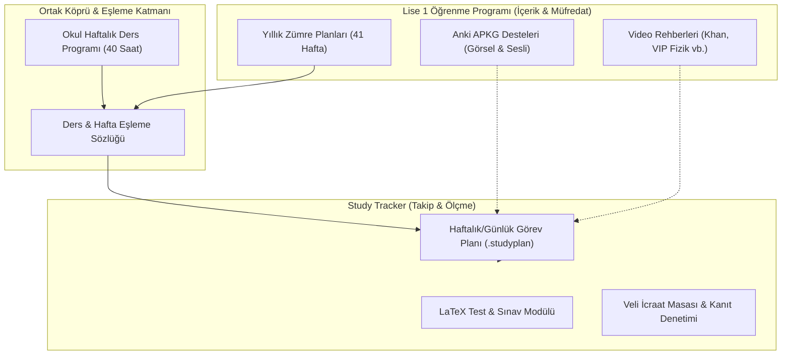

# 9. Sınıf Resmî Haftalık Ders Programı

Bu doküman, 9. Sınıf Anadolu Lisesi öğrencisinin güncel haftalık ders çizelgesini ve `Lise 1 Öğrenme Programı` (Yıllık Zümre Planları / Anki / Video Rehberleri) ile `Study Tracker` (Android Takip & Sınav Uygulaması) arasındaki **bağımsız ama koordineli köprü mimarisini** tanımlar.

---

## 📅 Güncel Haftalık Ders Programı

| Ders Saati | Pazartesi | Salı | Çarşamba | Perşembe | Cuma |
|---|---|---|---|---|---|
| **1. Ders** | Din Kültürü | Almanca | Matematik | Biyoloji | İngilizce |
| **2. Ders** | Din Kültürü | Almanca | Matematik | Biyoloji | İngilizce |
| **3. Ders** | Temel Dini Bilgiler | Matematik | Spor ve Fiziki Etk. | Türk Dili ve Ed. | Bilişim Tek. |
| **4. Ders** | Temel Dini Bilgiler | Matematik | Spor ve Fiziki Etk. | Türk Dili ve Ed. | Fizik |
| **5. Ders** | Tarih | Türk Dili ve Ed. | Beden Eğitimi | Görsel Sanatlar | Fizik |
| **6. Ders** | Tarih | Türk Dili ve Ed. | Beden Eğitimi | Görsel Sanatlar | Rehberlik |
| **7. Ders** | Matematik | İngilizce | Sağlık Bilgisi | Coğrafya | Kimya |
| **8. Ders** | Matematik | İngilizce | Türk Dili ve Ed. | Coğrafya | Kimya |
| **Tören** | 🇹🇷 İstiklal Marşı | — | — | — | 🇹🇷 İstiklal Marşı |

---

## 📊 Ders Dağılımı ve Haftalık Toplam Saatler

- **Matematik:** 6 Saat (Pzt 2, Salı 2, Çarş 2)
- **Türk Dili ve Edebiyatı:** 5 Saat (Salı 2, Çarş 1, Perş 2)
- **İngilizce:** 4 Saat (Salı 2, Cuma 2)
- **Fizik:** 2 Saat (Cuma 2)
- **Kimya:** 2 Saat (Cuma 2)
- **Biyoloji:** 2 Saat (Perşembe 2)
- **Tarih:** 2 Saat (Pazartesi 2)
- **Coğrafya:** 2 Saat (Perşembe 2)
- **Almanca:** 2 Saat (Salı 2)
- **Din Kültürü ve Ahlak Bilgisi:** 2 Saat (Pazartesi 2)
- **Temel Dini Bilgiler:** 2 Saat (Pazartesi 2)
- **Spor ve Fiziki Etkinlikler:** 2 Saat (Çarşamba 2)
- **Beden Eğitimi ve Spor:** 2 Saat (Çarşamba 2)
- **Görsel Sanatlar:** 2 Saat (Perşembe 2)
- **Bilişim Teknolojileri:** 1 Saat (Cuma 1)
- **Rehberlik ve Yönlendirme:** 1 Saat (Cuma 1)
- **Sağlık Bilgisi ve Trafik Kültürü:** 1 Saat (Çarşamba 1)
- **Toplam:** **40 Saat / Hafta**

---

## 🌉 Study Tracker ⇄ Lise Planlama Entegrasyon Köprüsü

> [!IMPORTANT]
> **Mimari İlke:** Kod tabanları ve veri modelleri birleştirilmez (Loose Coupling). Her iki sistem bağımsız çalışır ancak ortak veri sözlüğü ve zamanlama köprüsü üzerinden haberleşir.

### Köprü Fonksiyonları:
1. **Günlük Senkronizasyon:** Okulda o gün işlenen derslerin (örneğin Perşembe: Biyoloji, TDE, Görsel Sanatlar, Coğrafya) ilgili haftadaki zümre kazanımları, Study Tracker'da akşam etüdü / tekrar görevi olarak tetiklenebilir.
2. **Hedef Odaklı Test & Kart Ataması:** Study Tracker üzerinden öğrencinin çözeceği LaTeX formatlı quizler ve Anki tekrarları, okuldaki ders günleriyle paralel olarak zamanlanır.
3. **Akıllı Yük Dengeleme:** Ağır ders günlerinde (ör. Cuma: Fizik + Kimya + İngilizce) akşam ödev ve etüt süreleri dengelenir; hafif günlerde Anki/video pekiştirmelerine ağırlık verilir.
